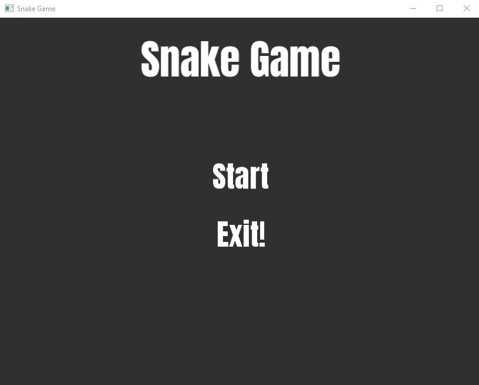
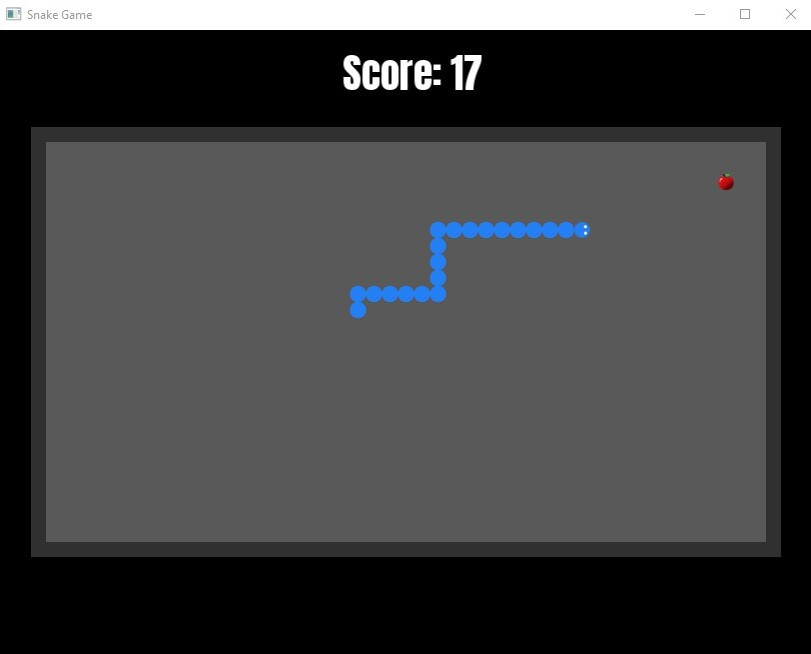
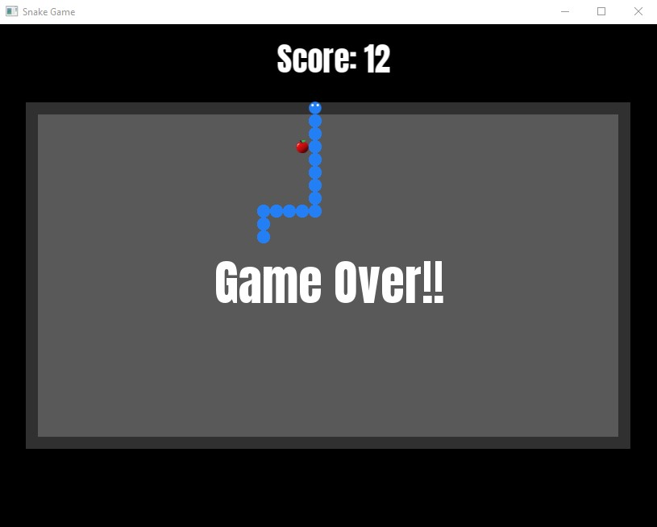

# Snake_Game
## Un jeu du serpent classique réalisé en C++ et la bibliothèque SFML

---

### La compilation et l'exécution du projet!!
- Vous devez installer la bibliothèque SFML.
- Utilisez ces commandes dans votre terminal (Assurez-vous que vous êtes dans le répértoire /src)
- g++ -c .\main.cpp .\Board.cpp .\Food.cpp .\Snake.cpp .\GameLogic.cpp .\GameMenu.cpp -I(the path of the SFML)/include -DSFML_STATIC -I(the path of the workspace folder)/include
- g++ .\main.o .\Board.o .\Food.o .\Snake.o .\GameLogic.o .\GameMenu.o -o mySG -L(the path of the SFML)/lib -lsfml-graphics-s -lsfml-window-s -lsfml-system-s -lopengl32 -lfreetype -lwinmm -lgdi32
- .\mySG.exe

### Screenshots:
- Menu:

- le jeu

- Fin du jeu

